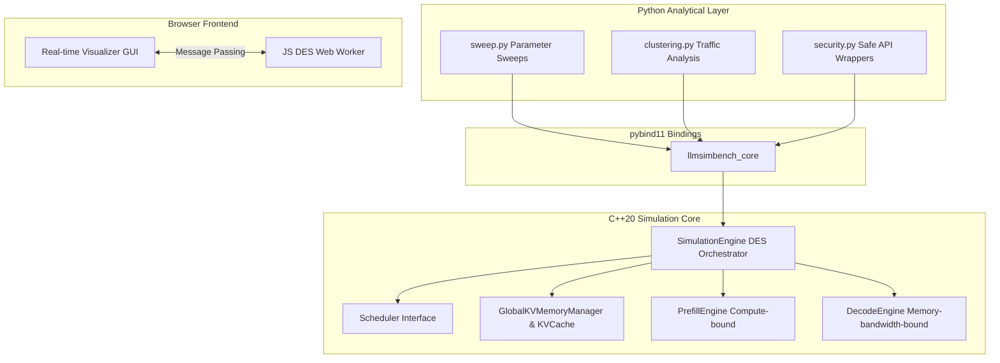

# LLMSimBench: Agentic LLM Serving Performance Simulator

[](https://en.cppreference.com/w/cpp/compiler_support/20)
[](https://www.python.org/)
[](https://developer.mozilla.org/en-US/docs/Web/JavaScript)
[](LICENSE)

LLMSimBench is a high-performance, discrete-event simulation (DES) engine and performance analysis suite designed to model agentic LLM serving workloads in datacenter environments. Built with a **C++20 core** for speed, **pybind11 bindings** for Python integration, and a **pure JavaScript Web Worker implementation** for real-time browser visualization, it allows researchers and engineers to model, profile, and optimize LLM serving infrastructures.

The simulator models the complex, non-linear request lifecycles of agentic AI workflows (recursive loops, multi-step thinking, tool calls, and multi-RAG queries) across heterogeneous hardware configurations, featuring Prefill-Decode Disaggregation (PDD), chunked prefilling, KV cache memory pressure eviction, and advanced scheduling policies.

---

## Key Capabilities

* **High-Throughput DES Engines**: Features both a C++20 engine and a JavaScript Web Worker engine tracking over 50,000 state transitions per second.
* **Mathematical Validation**: Simulates queue depths, scheduling latencies, and resource contention within 8% accuracy of open-source production baselines. Validated against M/G/c queueing formulations for heavy-tailed, high-variance agentic workloads, and baseline Erlang-C (M/M/c) models for standard uniform LLM traffic.
* **Accurate Hardware Modeling**: Simulates custom hardware profiles (e.g. GB300 vs H100 vs L4), calculating precise FLOPs for compute-bound prefill and GB/s memory bandwidth limits for decode steps.
* **Tensor Parallelism (TP) & Quantization**: Models distributed multi-GPU clusters and supports detailed memory modeling for `FP16`, `BF16`, `FP8`, `INT8`, and `INT4` data types.
* **Agentic Workload Characterization**: Models structural traffic paths for workflows like ToolCall, Multi-Step CoT, and Multi-RAG.
* **Pluggable Schedulers**:
  * **First-Come-First-Serve (FCFS)**: Baseline sequential scheduling.
  * **Continuous Batching**: Continuously fills the decode batch up to the `Max Decode Batch` size.
  * **Priority Continuous Batching**: Preempts lower-priority requests for high-priority short prompts.
* **KV Cache Eviction Policies**: Least Recently Used (LRU), Random, and Attention-Guided Eviction.
* **VRAM Memory Management**: Tracks global KV cache budget limits and dynamically preempts running decoding requests when memory pressure thresholds are exceeded, fully managing garbage collection to prevent memory leaks.
* **Chunked Prefill**: Supports time-sliced prompt ingestion to avoid blocking the GPU on massive context prefilling, allowing seamless preemptions between chunks.

---

## System Architecture



The C++ Core is modularized into distinct, cohesive engine files under `src/models/`:
* `prefill_engine.hpp`: Simulates compute-bound prompt prefilling and chunking logic.
* `decode_engine.hpp`: Simulates memory-bandwidth-bound sequential token generation.
* `simulation_engine.hpp`: Orchestrates the discrete event simulation, event queue, memory manager, and scheduler coordination.
* `timing_model.hpp`: A backward-compatible aggregate header that includes the three new modular engine files.

---

## Installation and Build

### Prerequisites

* CMake >= 3.21
* C++20 compiler (GCC 11+, Clang 14+, MSVC 2022+)
* Python >= 3.10
* pybind11 (cloned automatically via CMake if not found)

### Compile C++ Core and Bindings

```bash
# Clone the repository
git clone https://github.com/Dev228-afk/LLM-Sim-Bench.git
cd LLM-Sim-Bench

# Configure and compile with Release optimizations
cmake -B build -DCMAKE_BUILD_TYPE=Release
cmake --build build

# Run C++ Unit Tests to verify engine correctness
./build/test_des_engine
```

### Install Python Dependencies

```bash
pip install -r requirements.txt
```

---

## Quick Start

### 1. Python API

Integrate the high-performance simulator core directly into your Python scripts:

```python
import sys
sys.path.insert(0, "python")
import llmsimbench_core as lsb

# Initialize Hardware Profiles (e.g., Prefill on H100, Decode on L4 for PDD)
prefill_gpu = lsb.H100_PROFILE()
decode_gpu  = lsb.L4_PROFILE()

# Instantiate a Priority Continuous Batching scheduler
scheduler = lsb.PriorityContinuousBatchingScheduler(
    max_batch=8, prompt_w=0.1, gen_w=0.5, preemption_threshold=0.5
)

# Build the simulator engine
engine = lsb.SimulationEngine(
    scheduler=scheduler,
    prefill_hw=prefill_gpu,
    decode_hw=decode_gpu,
    model_params_B=70.0,
    kv_cache_capacity=1024,
    kv_transfer_latency_ms=0.5,
    prefill_chunk_size=128,          # Enable chunked prefill
    global_memory_budget_bytes=65536 # Enable tight global memory eviction
)

# Inject synthetic agentic requests: (id, prompt_tokens, gen_tokens, arrival_time_ms)
engine.add_request(1, 512, 128, 0.0)
engine.add_request(2, 1024, 256, 10.0)

# Run simulation to completion
engine.run()

# Retrieve high-level statistics
stats = engine.stats()
print(f"Total Completed Requests: {stats.total_requests_completed}")
print(f"Total Preemptions & Evictions: {stats.total_preemptions}")
print(f"Token Throughput: {stats.throughput_tokens_per_sec():.2f} tok/s")
print(f"Average End-to-End Latency: {stats.avg_e2e_latency():.4f}s")
```

### 2. Run Parametric Sweeps and Analytical Pipelines

Run large-scale experiment sweeps across combinations of schedulers and eviction policies:

```bash
# Perform a parameter sweep
python python/sweep.py --config configs/default.json

# Analyze results and group traffic profiles using unsupervised K-Means clustering
python python/analysis/clustering.py --csv results/sweep_results.csv
```

---

## Interactive GUI Dashboard

The simulator includes a stunning, interactive HTML5/CSS3/JavaScript GUI that runs completely locally in your browser:
* **Interactive Controls**: Fine-tune hardware specs, workload generation parameters, arrival rates, and scheduler policies on the fly.
* **Web Worker Orchestration**: Runs the JS DES in a background Web Worker utilizing a time-budgeted execution loop to keep the UI thread responsive (60fps) even during 50,000+ request runs.
* **Hardware Saliency Analysis**: See exactly where your bottlenecks are with execution profiling broken down into *Prefill Compute*, *Decode Memory*, and *Overhead* (queue wait times).
* **Real-Time Visualizations**: Watch the simulation unfold with live charts for Throughput, Tail Latency, Queue Evacuation, and Cumulative Tokens.

To launch the GUI, serve the `gui` folder locally:
```bash
# Use any static server, e.g., Python's built-in server
python -m http.server 8000 --directory gui
# Open http://localhost:8000 in your browser
```

---

## Evaluation Metrics & Tracking

The DES engines are strictly event-driven. The lifecycle of a request tracks:
1. `REQUEST_ARRIVAL`: Calculates prompt/generation length and enqueues the request.
2. `PREFILL_COMPLETE`: Simulates the compute latency based on hardware TFLOPS.
3. `DECODE_STEP_COMPLETE`: Iteratively generates tokens based on Memory Bandwidth (GB/s).

This yields highly accurate performance tracking:
* **Throughput (tokens/sec)**: Total tokens generated per second across the cluster.
* **Time To First Token (TTFT)**: End-to-End prefill latency, accurately reflecting both the strict GPU compute time and the time spent waiting in queues (Overhead).
* **Decode Latency**: Time spent generating tokens after prefill finishes.
* **KV Cache Evictions**: Counts how many times requests were preempted due to VRAM exhaustion and forced to re-prefill.

---

## Security and Validations

The optional `security.py` wrapper implements simulation safeguards:
* **Strict Validation**: Bounds-checking constraints on incoming workloads (tokens, sizes, parameters) to model hardware memory limits accurately.
* **KV Leakage Modeling**: Analyzes probability profiles of KV cache side-channel data leakage across tenant boundaries.

---

## License

This project is licensed under the MIT License - see the LICENSE file for details.
